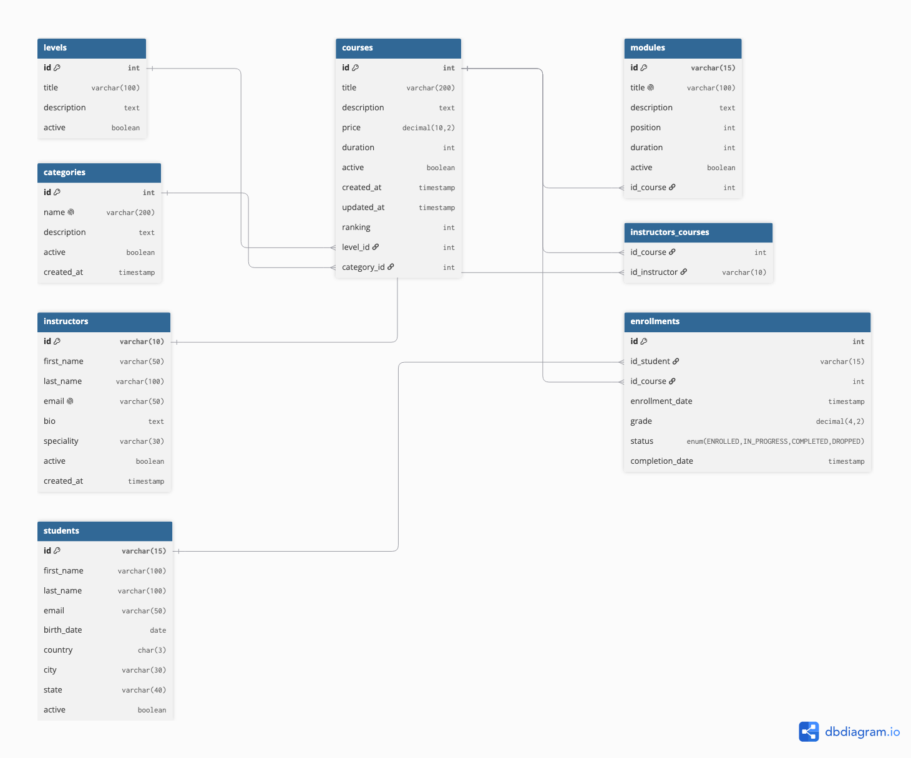

# Persistencia con Hibernate — DGTIC-UNAM

### Módulo 3 · Diplomado Desarrollo de Sistemas con Tecnología Java · Edición 20

Repositorio oficial del módulo **Persistencia con Hibernate** del diplomado de Java impartido por la Dirección General de Cómputo y de Tecnologías de Información y Comunicación (DGTIC) de la UNAM.

El proyecto **LearnHub** — es una plataforma de cursos online — se construye incrementalmente a lo largo de 4 sesiones, aplicando JPA e Hibernate sobre MariaDB.

---

##  Contenido del módulo

| Branch | Sesión | Tema | Contenido |
|--------|--------|------|-----------|
| `main` | — | Proyecto base | README, DDL, recursos, guías |
| `sesion-01` | ORM y Configuración | Entidades básicas + CRUD | `Category`, `Instructor`, `Course`, persistence.xml, HibernateUtil |
| `sesion-02` | Relaciones y Ciclo de Vida | Mapeo de relaciones | `@ManyToOne`, `@OneToMany`, `@ManyToMany`, `Module`, `Student`, `Enrollment`, cascade, orphanRemoval, LAZY vs EAGER |
| `sesion-03` | HQL y Consultas | Queries avanzadas | HQL, parámetros nombrados, JOINs, agregaciones, `@NamedQuery`, Criteria API, paginación |
| `sesion-04` | Validaciones y Proyecto Final | Bean Validation + DAO | `hibernate-validator`, `@NotBlank`, `@Email`, `@Min`, Hibernate Filters, patrón DAO, refactorización |

```bash
# Clonar el repositorio
git clone https://github.com/tu-usuario/jpahibernate_dgtic.git

# Cambiar a la sesión deseada
git checkout sesion-01
```
---

##  Stack Tecnológico

| Tecnología | Versión |
|------------|---------|
| Java | OpenJDK 17 |
| Hibernate ORM | 6.4.x |
| Jakarta Persistence (JPA) | 3.1 |
| MariaDB | 10.6.x |
| Maven | 3.9+ |
| Hibernate Validator | 8.0.x |
| Lombok | 1.18.x |
| JUnit 5 | 5.10.x |
| GitHub Copilot Free | Plugin IntelliJ |

---

## 🗄️ Modelo de Datos — LearnHub

[](https://dbdiagram.io/d/LearningHub-MioLearn-6a7684f035ee2e87b058b4e9)

**8 tablas** · **104 registros de ejemplo** · DDL y DML incluidos en `/resources/db/learnhub/DDL_LearnHub_v1.0.0.sql`

---

## 📝 Guías y Recursos

| Documento | Descripción |
|-----------|-------------|
| [Requisitos Previos](docs/01-Requisitos-Previos.md) | Software, dependencias y conocimientos necesarios |
| [Guía de Configuración](docs/02-Guia-Configuración.md) | Instalación paso a paso del entorno completo |
| [Cheat Sheet](docs/03-Cheat-Sheet.md) | Referencia rápida de anotaciones, HQL y patrones |
| [pom.xml + persistence.xml](docs/04-pomxml-persistencexml.md) | Archivos de configuración listos para usar |
| [Guía de GitHub Copilot](docs/05-Guia-Copilot.md) | Cómo usar IA como herramienta de aprendizaje |

---


## 📄 Licencia

Material educativo desarrollado para el Diplomado de Java de DGTIC-UNAM. Uso exclusivamente académico.

---

<p align="center">
  <strong>DGTIC-UNAM</strong> · Dirección General de Cómputo y de Tecnologías de Información y Comunicación<br>
  Instructor: Alfonso Hernández Xochipa · <a href="http://hxadev.tech">hxadev.tech</a>
</p>
